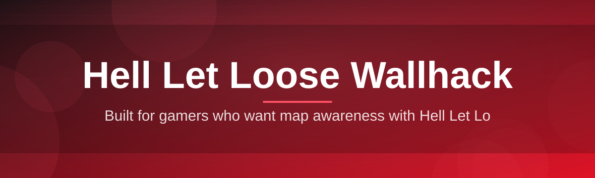
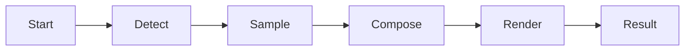

# hell-let-loose-overlay-assistant 🎯🛰️

  

*A lightweight tactical overlay that turns the fog of Hell Let Loose into a readable map.*

  

---

## 🧭 Overview

**hell-let-loose-overlay-assistant** is a standalone Windows overlay built for players who want a clearer read of the battlefield in Hell Let Loose. Instead of guessing where the next contact is coming from, the overlay renders positional cues — squad markers, garrison hints, capture-zone pressure — directly on top of your game window, without touching game files or memory.

The project exists because Hell Let Loose is a game of information asymmetry. Commanders who can see the shape of the fight — where lines are thin, where a flank is forming — make better calls. This tool is aimed at squad leads, commanders, and casual players who want a second pair of eyes on the map without breaking focus to alt-tab.

It is written to be **transparent, auditable, and dependency-free**. No background services, no telemetry you didn't ask for, no hidden network calls. What you see in the overlay is what the tool does — nothing more.

> [!NOTE]
> This is a visual overlay assistant, not a modification to the Hell Let Loose game client. It reads publicly available on-screen and match data and renders a companion layer above the game window.

---

## ⚡ Quick Start

**1. Visit the landing page** and grab the latest build — no account, no installer wizard.

**2. Run the executable** directly. There's nothing to compile and nothing to configure on first launch.

**3. Launch Hell Let Loose**, tab back in, and the overlay locks onto the game window automatically.

---

## 🧩 What It Actually Does

- **Squad-relative positioning** — markers are anchored to your squad's frame of reference, not a raw top-down guess, so orientation stays intuitive mid-firefight.

- **Garrison and OP pulse indicators** — a soft pulse on active spawn structures tells you at a glance whether your logistics are healthy.

- **Capture-zone pressure meter** — a compact bar per point shows how contested a zone is trending, updated between ticks.

- **Low-profile rendering** — the overlay draws at a deliberately low opacity so it never competes with your actual game feed for attention.

- **Zero-footprint architecture** — nothing is written into the Hell Let Loose process; the assistant lives entirely in its own window layer.

- **Hotkey-first design** — every panel can be summoned, dimmed, or dismissed without reaching for a mouse.

- **Multi-monitor awareness** — if you run the game on a secondary display, the overlay follows the correct window automatically.

- **Session-only memory** — nothing persists between matches unless you explicitly save a layout.

> [!TIP]
> Start with the overlay at its default 35% opacity. Most players find full opacity distracting during actual engagements — the assistant is meant to be glanced at, not stared at.

---

## 🚀 How To Get Started

1. **Open the landing page** using the download button above.

2. **Download the latest release archive** — it's a single self-contained folder.

3. **Run the `.exe`** as a standard Windows application. No administrator elevation is required for normal use.

4. **Bind your preferred hotkeys** in the settings panel, then jump into a match to confirm the overlay is tracking correctly.

> [!IMPORTANT]
> Always download from the official landing page linked in this README. Third-party mirrors are not maintained by this project and may bundle unrelated software.

---

## 🖥️ System Requirements

| Component | Minimum | Recommended |
|---|---|---|
| **OS** | Windows 10 (64-bit) | Windows 11 (64-bit) |
| **RAM** | 4 GB | 8 GB |
| **Disk** | 150 MB free | 300 MB free |
| **GPU** | Integrated graphics | Dedicated GPU, 2 GB VRAM |
| **.NET / Runtime** | None required | None required |

> [!NOTE]
> The assistant ships as a standalone build. There are no external dependencies, runtimes, or frameworks to install separately.

---

## ⚙️ How It Works

The overlay operates as an independent rendering layer that observes and draws — it never reaches into the Hell Let Loose process itself.

1. **Window detection** — the assistant locates the active Hell Let Loose window and reads its bounds.

2. **Frame sampling** — a lightweight capture loop samples the visible frame at a conservative rate to stay light on resources.

3. **Overlay composition** — positional markers, pressure meters, and garrison indicators are composited into a transparent layer.

4. **Render pass** — the composited layer is drawn on top of the game window using standard Windows compositing, matched to your resolution.

5. **Idle throttling** — when the game window loses focus, rendering pauses automatically to save CPU cycles.

---

## 🛟 Troubleshooting

<strong>The overlay isn't appearing over my game window.</strong>

Confirm Hell Let Loose is running in **Borderless Windowed** or **Windowed** mode. True exclusive fullscreen prevents any overlay from compositing correctly on Windows.

<strong>Markers feel slightly offset from where I expect them.</strong>

This usually means your in-game resolution and desktop resolution don't match. Set both to the same value, or use the "Auto-Calibrate" button in settings.

<strong>The app won't launch and nothing happens.</strong>

Check that no antivirus heuristic quarantined the executable on first run — overlay tools sometimes trigger generic behavioral flags. Restore it from quarantine and re-run.

<strong>My frame rate dropped after launching the overlay.</strong>

Lower the sampling rate in **Settings → Performance**. On integrated graphics, dropping from 60Hz sampling to 30Hz sampling is usually unnoticeable visually but meaningfully lighter.

<strong>Can I run this alongside voice comms or Discord overlays?</strong>

Yes. The assistant renders independently and does not conflict with other overlay software under normal use.

> [!WARNING]
> Server-side anti-tamper systems evolve independently of this project. Always review the current Hell Let Loose terms of service before using any companion tool in ranked or competitive matches.

---

## 🎨 UI / UX Details

**Keyboard-first controls:**

| Shortcut | Action |
|---|---|
| `Ctrl + Shift + O` | Toggle overlay visibility |
| `Ctrl + Shift + M` | Cycle marker density |
| `Ctrl + Shift + L` | Lock/unlock current layout |
| `Ctrl + Shift + K` | Open hotkey reference card |

**Themes:** Dark (default), High-Contrast, and a low-saturation "Field" theme designed for long sessions.

**Settings persistence:** Layouts and hotkeys are saved locally in a plain settings file — nothing is synced externally unless you enable cloud backup manually.

> [!TIP]
> The "Field" theme desaturates markers so they read as shape and motion rather than color, which many players find easier to parse peripherally.

---

## 🤝 Contributing & Community

Contributions are welcome — from bug reports to UI polish to translation work.

- Open an **Issue** for bugs, with your Windows build and GPU listed.

- Open a **Discussion** for feature ideas before submitting a large pull request.

- Small, focused pull requests are reviewed faster than sweeping rewrites.

> Community feedback shapes the roadmap more than any internal backlog. If a marker style annoys you, say so.

  

---

## 📄 License

Released under the [MIT License](LICENSE), 2026.

---

## ⚠️ Disclaimer

This project is an independent overlay assistant and is **not affiliated with, endorsed by, or associated with** Team17 or Black Matter, the publisher and developer of Hell Let Loose. All trademarks belong to their respective owners.

> [!IMPORTANT]
> Use of any companion overlay software is at the user's own discretion and risk. Review the current terms of service for Hell Let Loose before using this tool in any online session.

---

